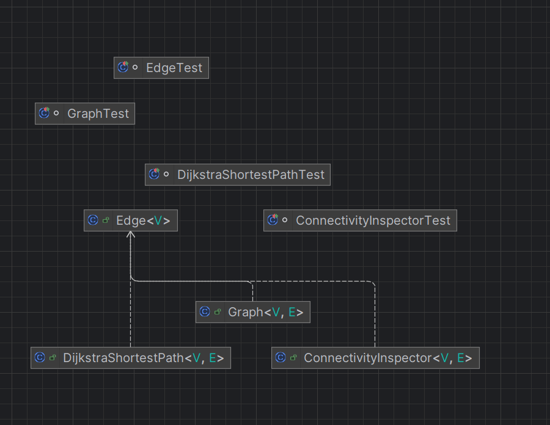

# PROJET_S6 (RailRoad) - Administrateur

## Description

Ce projet implémente un administrateur pour le jeu **RailRoad Ink**.
L'administrateur est responsable de la gestion du jeu et du respect des règles.

## Pré-requis

- **Java** : Version 11
- **Maven** : Version 4.0.0
- **JUnit5** : Inclus via Maven

## Connexion

L'administrateur se connecte à un **réflecteur d'adresse** situé à :

```
ws://localhost:8000
```

## Installation et Exécution

1. Compiler le projet avec Maven :

- Commande pour clean

  ```bash
  mvn clean 
  ```
- Commande pour compiler

  ```bash
  mvn package
  ```

2. Lancer l'administrateur :
   ```bash
   make run
   ```

## Explication du code

L'administrateur agit comme un client qui interprète les messages reçus grâce à une classe [Interpreteur](railroad/src/main/java/interpreter/Interpreter.java).

<u>Voici les principales étapes du fonctionnement :</u>

1. **Interprétation des messages** :

   - Les messages reçus sont analysés par l'[Interpreteur](railroad/src/main/java/interpreter/Interpreter.java), qui les transforme en objets de type [Message](railroad/src/main/java/util/Message.java).
   - Chaques [Messages]("railroad/src/main/java/util/Message.java") est ensuite traité par un **Interpreteur de commande**, qui exécute l'action correspondante([ENTERS](railroad/src/main/java/commands/Enters.java), [ELECTS](railroad/src/main/java/commands/Elects.java), etc...).
2. **Élection d'un joueur** :

   - Pour être considéré comme un joueur officiel du jeu, il faut envoyer la commande :
     ```bash
     <ID> ELECTS <ID*>
     ```
   - Une fois élu, le (ou les) joueur devient un *Elected Player* et est intégré en tant que joueur pouvant véritablement jouer dans le [Game](railroad/src/main/java/main/Game.java) .
3. **Lancement du jeu** :

   - Pour lancer le jeu, il faut utiliser la commande :
     ```bash
     <ID> PLAYS
     ```
   - Pour assurer le respect des règles et permettre au client de continuer à recevoir des messages, nous avons recodé le jeu et ses règles et lançons le jeu suite à la reception de cette commande dans un **thread**.
4. **Placement des tuiles** :

   - Pour placer une tuiles ([Face](railroad/src/main/java/face/AbstractFace.java) pour nous), il faut utiliser la commande :
     ```bash
     <ID> PLACES <FACE> <ROTATION> <POSITION>
     ```
   - Les tuiles sont représentées dans notre implémentation par la classe [Face](railroad/src/main/java/face/AbstractFace.java).
   - Si un placement est valide, il est accepté ; sinon, un message **BLAMES** est renvoyé.
5. **Calcul des points** :

   - À chaque fois qu'un joueur envoie un [PLACES](railroad/src/main/java/commands/Places.java), l'administrateur calcule les points générés par ce coup.
   - Il envoie ensuite au joueur des messages:
     ```bash
     admin SCORES <RANG> <SCORE TYPE> <POINTS>
     ```

## UML

### Module _Graph_



### Module _Railroad_


